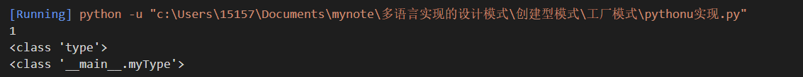
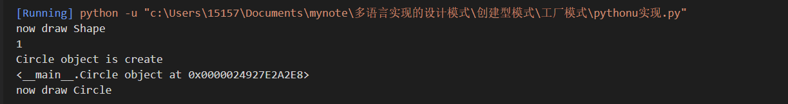

# 工厂模式
## 一种创建对象的模式，基于输入，应用在超类和子类之间的情况，这种模式将创建对象的责任转移到工厂类；
## 可以通过一个类工厂 囊获一类类实例化的职责 通过一个类可以实例化多个类型不同的类对应的类型对象
## 通常这些类都要有一定相似的地方可以用来抽象
# *java实现*
###   超类可以是接口，抽象类，父类，本例中将通过重写tostring()方法来解释通常方法为模式；

###  ```Shape.java```
```java
public interface  Shape{
    void draw();
}
// 通过一个接口实现的工厂模式 主接口 要实现的高度一个工厂中所有类具有的高度抽象花
```
### ```Circle.java```
```java
public class Circle implements Shape{
    // 圆形工厂 实现一条生产圆形的生产线 一个子工厂
    @Override
    public void draw(){
        System.out.println("Inside Circle::draw() method.");
    }

}
```
### ```Rectangle.java```
```java
public class Rectangle implements Shape{
    // 生产矩形的生产线
    // 重写 类工厂要实现的接口 一个子工厂
    @Override
    public void draw(){
        System.out.println("Intside  Rectangle::draw() mothod.");
    }
}
```
### ```ShapeFactory.java``` 工厂类的具体实现
```java
import java.awt.Rectangle;

public class ShapeFactory {
    // 囊获所有的生产线 实现一个多生产线的类工厂 专门生产用户所需的类

    public Shape getShape(String shapeType){
        // 使用getShape方法 获取要创建的生产线 既工厂里要实例化的类具体是哪个
        if (shapeType == null){
            return null;
        }
        if (shapeType.equalsIgnoreCase("CIRCLE")){
            return new Circle();
        }else if (shapeType.equalsIgnoreCase("RECTANGLE")){
            return new Rectangle();
        }else if (shapeType.equalsIgnoreCase("SQUARE")){
            return new Square(); 
        }
        return null;
    }
}
```

### ```FactoryPatternDemo.java``` 实例化工厂里面的类 执行
```java
// 主程序判断要实例化的工厂或者流水线是哪个 做出执行

public class FactoryPatternDemo{
    public static void main(String[] args){
        // 实例化类工厂
        ShapeFactory shapeFactory = new ShapeFactory();
        //  指定具体要实现的流水线（小工厂） 圆形流水线
        Shape shape1 = shapeFactory.getshape("CIRCLE");
        shape1.draw(); // 相当于生产操作
        // 指定要实现的流水线为矩形
        Shape shape2 = shapeFactory.getshape("RECTANGLE");
        shape2.draw();
        // 实现一个生产方形的工厂
        Shape shape3 = shapeFactory.getshape("SQUARE");
        shape3.draw();
    }


}
```
#  *python实现*
### 简易实现：
#### 通过type函数可以实现自定义类型，实现简单工厂
```python
myType = type('myType', (object,), {'a': 1})
ob = myType()
print(ob.a)
print(type(myType))
print(type(ob))
```

### 比较常规地实现java的思路实现工厂模式
```python
class Shape():
    @classmethod
    def draw(cls):
        print("now draw " + cls.__name__)

class Circle(Shape):
    #  circle流水线 
    def __init__(self):
        print("Circle object is create")

class Rectangle(Shape):
    def __init__(self):
        print("Rectangle object is create")

class Factory(object):
    '''工厂实现'''
    def __new__(self, methods):
        # new是运行在__init__之前的方法
        if methods == None:
            return None
        elif methods == "Circle":
            print('1')
            return  Circle()
        elif methods == 'Rectangle':
            return Rectangle()
        else:
            print("without ")
            return None

shape = Shape()
shape.draw()

circle = Factory('Circle')
print(circle)
circle.draw()
```


# php实现
```php
<?php
interface Shape{
    public function draw();
}
class Circle implements Shape{
    public function __construct()
    {
        echo "now construct Circle!";
    }
    public function draw()
    {
        echo "now draw Circle";
    }
}
class Recengle implements Shape{
    public function __construct(){
        echo "now construct Recengle!";
    }
    public function draw()
    {
        echo "now draw Recengle";
    }
}
class ShapeFactory{
    public static function getshape($shapetype){
        if ($shapetype == 'Circle'){
            return new Circle();
        }else if ($shapetype == 'Recengle'){
            return new Recengle();
        }
    }
}
$shapefactory = new ShapeFactory();
$circle = $shapefactory->getshape('Circle');
$circle->draw();
?>
```


